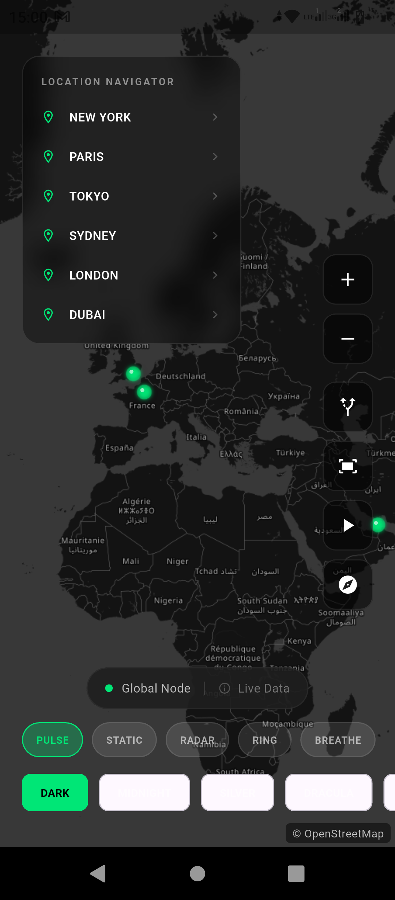
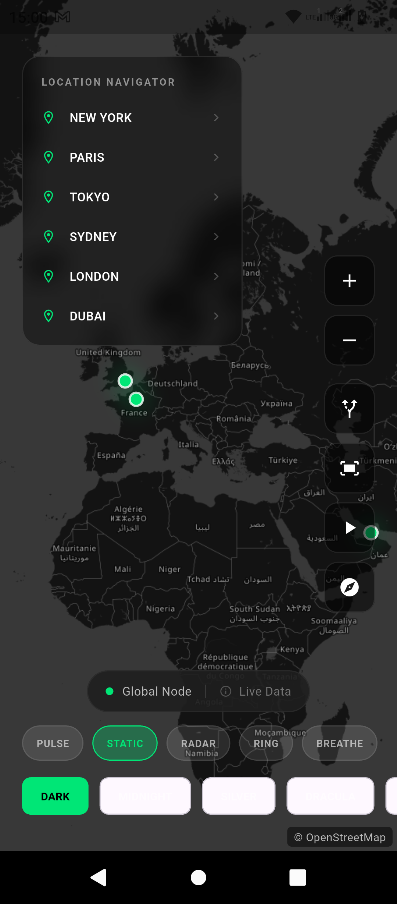
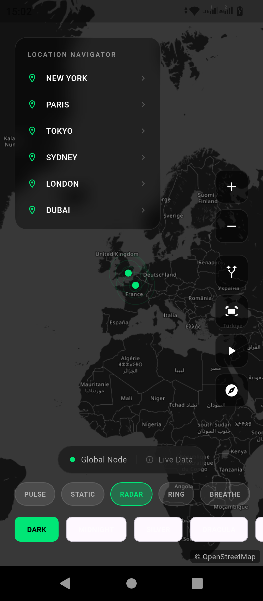
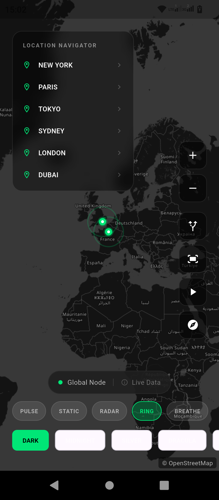
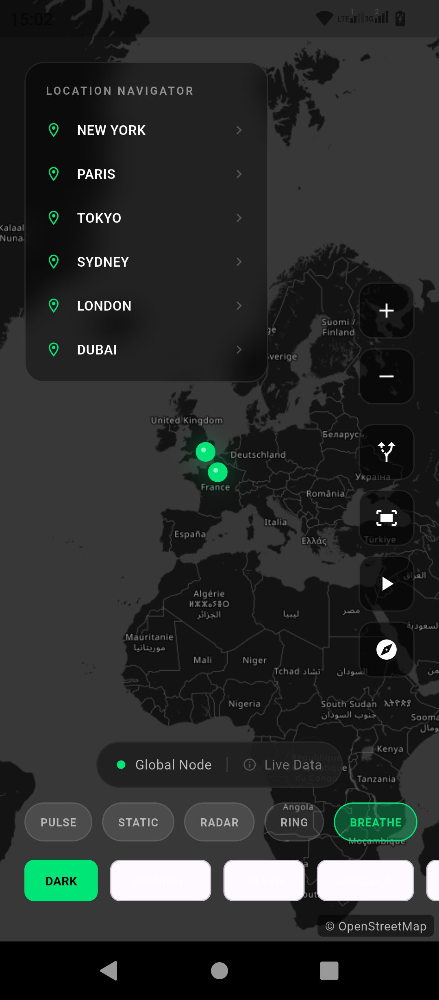
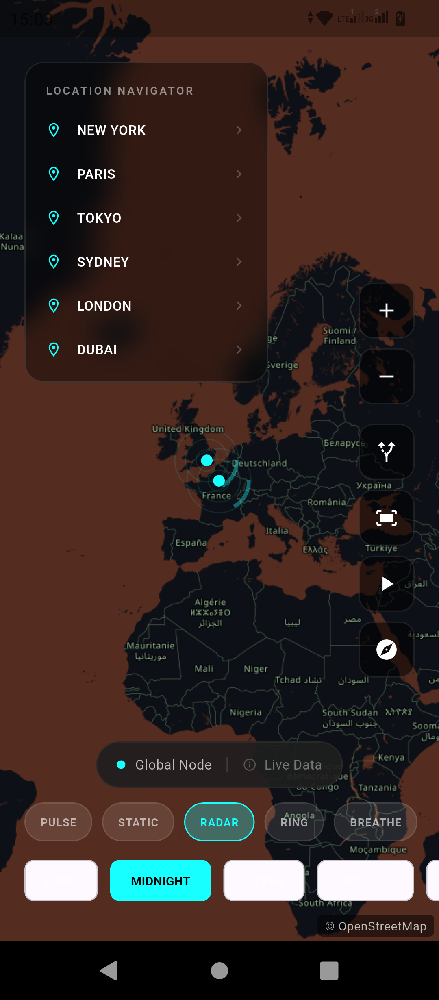
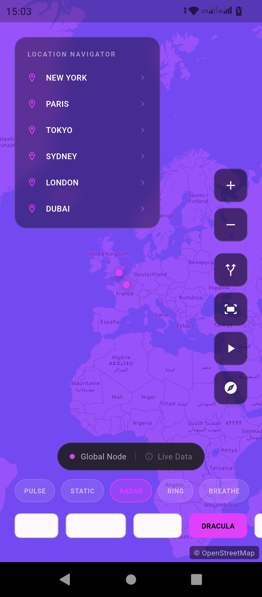
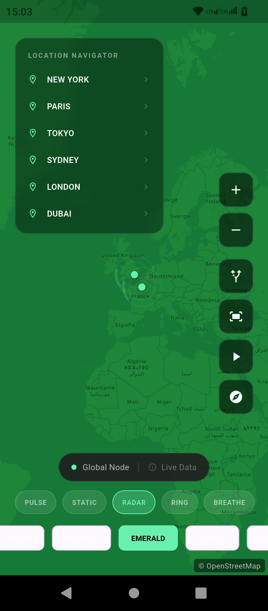
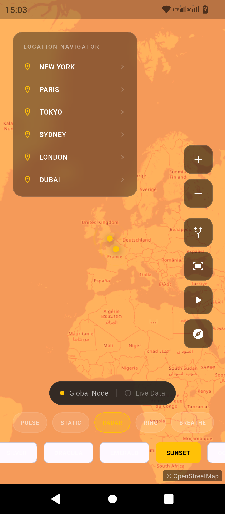
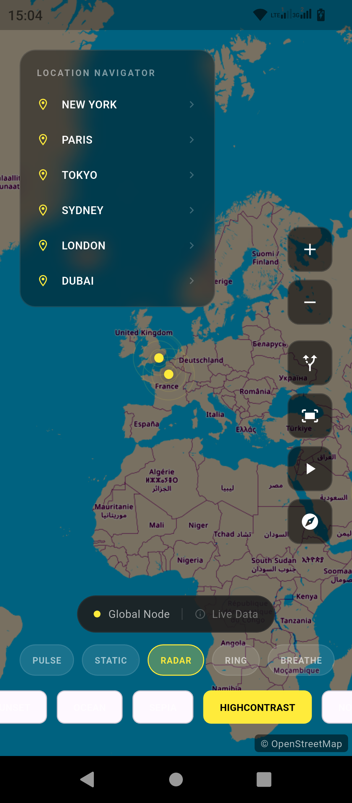

# Mapcn Flutter 🗺️

حزمة خريطة جميلة وقابلة للتخصيص بتصميم داكن لـ Flutter مع علامات متحركة، مسارات، ثيمات متعددة، وتحريكات كاميرا سلسة. مبنية على `flutter_map` للتكامل السهل.

## لقطات الشاشة

<p align="center">
  
  
  
</p>

<p align="center">
  
  
  
</p>

<p align="center">
  
  
  
</p>

<p align="center">
  
  
  
</p>

<p align="center">
  
</p>

##  المميزات

- ** 11 ثيم مدمج** - داكن، منتصف الليل، دراكولا، زمردي، فضي، غروب، محيط، سيبيا، تباين عالي، والمزيد
- ** 5 أنماط تحريك للعلامات** - نبض، ثابت، رادار، حلقة، وتنفس
- ** رسم المسارات** - ارسم مسارات بين النقاط مع أنماط وأسهم ونقاط نهاية قابلة للتخصيص
- ** تحريكات كاميرا سلسة** - الطيران إلى، جولات موجهة، ملاءمة جميع النقاط مع منحنيات جميلة
- ** مقاومة للأعطال** - آمن ضد القيم الفارغة، معالجة أخطاء صحيحة، والتخلص الآمن من التحريكات
- ** قابلة للتخصيص بدرجة عالية** - ألوان، أحجام علامات، سرعات تحريك، ومصفوفات ثيم مخصصة
- ** صديقة للمطورين** - توثيق API شامل ومتحكم سهل الاستخدام
- **محسنة للأداء** - RepaintBoundary، تخزين البلاطات، وإعادة رسم فعالة
- ** إسناد OSM** - امتثال رخصة OpenStreetMap مدمج

##  التثبيت

أضف إلى ملف `pubspec.yaml`:

```yaml
dependencies:
  mapcn_flutter: ^1.0.2
  latlong2: ^0.9.0
```

## البداية السريعة

### الاستخدام الأساسي

```dart
import 'package:mapcn_flutter/mapcn_flutter.dart';
import 'package:latlong2/latlong.dart';

Mapcn(
  initialCenter: LatLng(51.5074, -0.1278),
  initialZoom: 10,
  style: MapcnStyle.dark,
  points: [
    LatLng(51.5074, -0.1278),
    LatLng(48.8566, 2.3522),
  ],
  accentColor: Color(0xFF00E676),
)
```

### مع المتحكم (موصى به)

```dart
class _MyMapState extends State<MyMap> with TickerProviderStateMixin {
  late final MapcnController _controller;

  @override
  void initState() {
    super.initState();
    _controller = MapcnController(vsync: this);
  }

  @override
  void dispose() {
    _controller.dispose();
    super.dispose();
  }

  @override
  Widget build(BuildContext context) {
    return Mapcn(
      controller: _controller,
      initialCenter: LatLng(0, 0),
      points: myPoints,
      onMapReady: () => print('الخريطة جاهزة!'),
      onPointTap: (point) => _controller.flyTo(point, zoom: 12),
    );
  }
}
```

##  الثيمات المتاحة

| الثيم | الوصف | الأفضل لـ |
|-------|-------|----------|
| `dark` | أسود نقي وفضي | شاشات AMOLED، الوضع الداكن |
| `midnight` | أزرق منتصف الليل العميق | لوحات التحكم المهنية |
| `silver` | تدرج رمادي أحادي اللون | التصاميم البسيطة |
| `dracula` | درجات أرجوانية/داكنة | أدوات المطورين |
| `emerald` | أخضر غابة عميق | تطبيقات الطبيعة |
| `sunset` | برتقالي/كهرماني دافئ | واجهات مريحة |
| `ocean` | أزرق عميق | تطبيقات بحرية |
| `sepia` | مظهر ورق عتيق | تطبيقات تاريخية |
| `highContrast` | رؤية قصوى | إمكانية الوصول |
| `normal` | OSM قياسي | الوضع الفاتح |
| `custom` | مصفوفتك الخاصة | تحكم كامل |

### مصفوفة ثيم مخصصة

```dart
Mapcn(
  style: MapcnStyle.custom,
  customMatrix: MapcnThemes.createCustomTheme(
    brightness: -0.1,
    contrast: 1.2,
    saturation: 0.8,
    tint: Colors.blue,
    tintStrength: 0.2,
  ),
)
```

##  أنماط العلامات

```dart
Mapcn(
  markerConfig: MarkerConfig(
    style: MarkerStyle.pulse,    // نبض، ثابت، رادار، حلقة، تنفس
    coreRadius: 6,
    pulseRadius: 35,
    glowIntensity: 0.4,
    showShadow: true,
  ),
)
```

**إعدادات مسبقة:**
- `MarkerConfig.minimal` - علامات دقيقة وصغيرة
- `MarkerConfig.prominent` - كبيرة وملفتة للانتباه
- `MarkerConfig.elegant` - نمط حلقي، مظهر راقي

##  رسم المسارات

ارسم مسارات جميلة بين النقاط مع تخصيص كامل:

```dart
Mapcn(
  initialCenter: LatLng(40.0, -50.0),
  points: [newYork, london, paris],
  routes: [
    MapcnRoute(
      id: 'عابر_الأطلسي',
      points: [
        LatLng(40.7128, -74.0060),  // نيويورك
        LatLng(52.0, -35.0),         // نقطة وسط الأطلسي
        LatLng(51.5074, -0.1278),    // لندن
      ],
      config: RouteConfig(
        color: Colors.cyanAccent,
        width: 3.0,
        style: RouteStyle.solid,     // صلب، متقطع، منقط
        showArrows: true,
        showEndpoints: true,
        startColor: Colors.green,
        endColor: Colors.red,
      ),
    ),
  ],
)
```

### أنماط المسارات

| النمط | الوصف |
|-------|-------|
| `RouteStyle.solid` | خط متصل |
| `RouteStyle.dashed` | نمط خط متقطع |
| `RouteStyle.dotted` | نمط خط منقط |
| `RouteStyle.gradient` | تدرج من البداية للنهاية |
| `RouteStyle.animated` | تقدم مسار متحرك |

### خيارات RouteConfig

| الخاصية | النوع | الافتراضي | الوصف |
|---------|------|----------|-------|
| `color` | `Color` | أزرق | لون خط المسار |
| `width` | `double` | `3.0` | سماكة الخط |
| `style` | `RouteStyle` | `solid` | نمط الخط |
| `showArrows` | `bool` | `true` | إظهار أسهم الاتجاه |
| `showEndpoints` | `bool` | `true` | إظهار علامات البداية/النهاية |
| `startColor` | `Color?` | `null` | لون علامة البداية |
| `endColor` | `Color?` | `null` | لون علامة النهاية |
| `arrowSpacing` | `double` | `100.0` | المسافة بين الأسهم |

### أدوات المسارات

```dart
// حساب المسافة بين نقطتين
double distance = RouteUtils.calculateDistance(pointA, pointB);

// الحصول على الاتجاه
double bearing = RouteUtils.calculateBearing(pointA, pointB);

// تبسيط المسار للأداء
List<LatLng> simplified = RouteUtils.simplifyRoute(points, tolerance: 0.0001);

// الحصول على إجمالي مسافة المسار
double total = RouteUtils.totalDistance(points);

// استيفاء نقطة على طول المسار
LatLng midPoint = RouteUtils.interpolatePoint(start, end, fraction: 0.5);
```

## 🎮 طرق المتحكم

```dart
// التحريك إلى موقع
_controller.flyTo(LatLng(48.8566, 2.3522), zoom: 12);

// ملاءمة جميع النقاط على الشاشة
_controller.fitAllPoints(myPoints, padding: 50);

// أدوات التكبير
_controller.zoomIn();
_controller.zoomOut();
_controller.zoomStep(2.0);

// الدوران
_controller.rotateTo(45);
_controller.resetRotation();

// جولة موجهة عبر المواقع
await _controller.startTour(
  [paris, london, tokyo],
  zoom: 10,
  stopDuration: Duration(seconds: 2),
  onStopReached: (index, stop) => print('في المحطة $index'),
);

// انتقال فوري (بدون تحريك)
_controller.jumpTo(LatLng(0, 0), zoom: 5);
```

##  جميع خيارات الويدجت

| الخاصية | النوع | الافتراضي | الوصف |
|---------|------|----------|-------|
| `initialCenter` | `LatLng` | **مطلوب** | مركز الخريطة الابتدائي |
| `initialZoom` | `double` | `3.0` | مستوى التكبير الابتدائي |
| `style` | `MapcnStyle` | `dark` | الثيم البصري |
| `points` | `List<LatLng>` | `[]` | مواقع العلامات |
| `accentColor` | `Color` | `#00E676` | لون العلامات وواجهة المستخدم |
| `controller` | `MapcnController?` | `null` | متحكم التحريك |
| `markerConfig` | `MarkerConfig` | `default` | مظهر العلامات |
| `onPointTap` | `Function(LatLng)?` | `null` | استدعاء عند النقر على علامة |
| `onMapReady` | `VoidCallback?` | `null` | استدعاء عند جاهزية الخريطة |
| `showTooltip` | `bool` | `true` | إظهار النافذة المنبثقة المدمجة |
| `tooltipBuilder` | `Widget Function?` | `null` | نافذة منبثقة مخصصة |
| `showLoadingIndicator` | `bool` | `true` | إظهار مؤشر التحميل |
| `showAttribution` | `bool` | `true` | إظهار إسناد OSM |
| `minZoom` | `double` | `2.0` | الحد الأدنى للتكبير |
| `maxZoom` | `double` | `18.0` | الحد الأقصى للتكبير |
| `pulseDuration` | `Duration` | `2s` | وقت دورة التحريك |

## منع الأعطال

تتضمن الحزمة حماية مدمجة:

-  التخلص الآمن من المتحكم
-  تثبيت قيم التحريك
-  عمليات آمنة ضد القيم الفارغة
-  فحص حالة التركيب
-  قائمة انتظار العمليات المعلقة (عمليات قبل جاهزية الخريطة)
-  التحقق من صحة المصفوفة للثيمات المخصصة
-  معالجة أخطاء تحميل البلاطات بسلاسة

##  الرخصة

mention me @Ahmed Ziet

##  المساهمة

نرحب بالمساهمات! لا تتردد في تقديم طلب سحب (Pull Request).

---

صُنع بـ ❤️ لمجتمع Flutter بواسطة أحمد زيات
